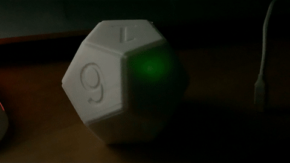
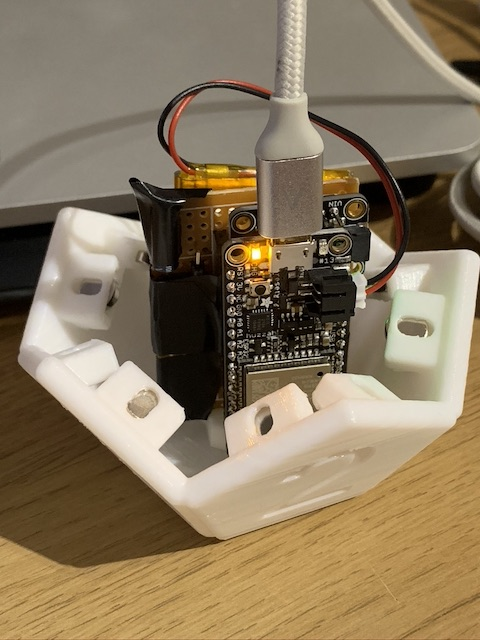
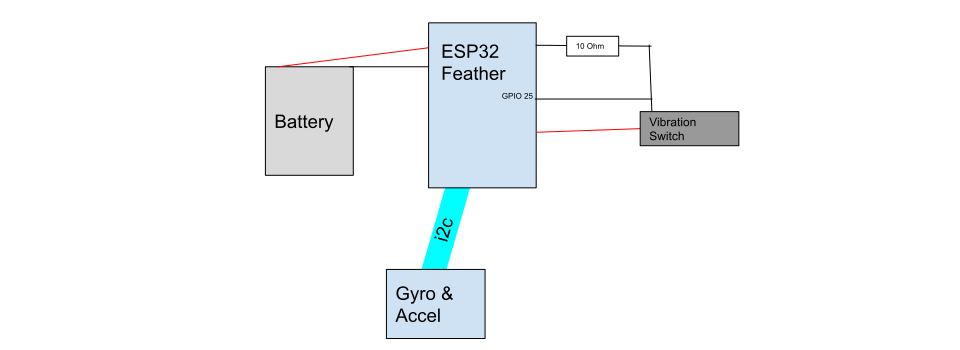

# dodecahedron-switch
Sort of a (probably more expensive) (less good) DIY version of [the nanoleaf remote](https://www.youtube.com/watch?v=FFnLSsW_xBE)

| Setting HomeKit Scenes | Charging |
| --- | --- |
|  |  |
## BOM

| Part | Link |
|--|--|
| Adafruit HUZZAH32 | https://thepihut.com/products/adafruit-huzzah32-esp32-feather-board-ada3405?variant=12364065701950 |
|Fast Vibration Sensor Switch| https://thepihut.com/products/fast-vibration-sensor-switch-easy-to-trigger?variant=27739606289 |
| Adafruit LSM6DS33 + LIS3MDL - 9 DoF IMU with Accel / Gyro / Mag | https://thepihut.com/products/adafruit-lsm6ds33-lis3mdl-9-dof-imu-with-accel-gyro-mag?variant=31486702354494 |
| EEMB 3.7V 1100mAh 603449 Lipo Battery | https://www.amazon.co.uk/gp/product/B08FD39Y5R |
|Yizhet 50pcs N38 Neodymium Strong Magnets | https://www.amazon.co.uk/gp/product/B074C79DJS |
| SUNLU PLA plus white | https://www.amazon.co.uk/gp/product/B07R8X76GW |
| perfboard, wires, connectors etc ||

## Construction

- The magnets fit into the slots within the upper & lower halves, 2 pairs of magnets should be reversed so the two halves have a prefered way of clasping together
- Once the circuit's on the perfboard chop off some of the excess board & use the [circuit_connector](./models/circuit_connector.stl) (and probably some hot glue) to attach it with the top of the ESP32 facing the number 2.

### Circut Diagram

# Possible improvements
 - Expose as real homekit device rather than use Homebridge-mqtt, there's an ESP32 homebridge library but it looked complicated & didn't appear to work in ardiuno mode
 - Internal LEDs, I bought some planning to put them in but I couldn't be bothered with the additional power draw & complexity
 - Use a transistor to power on the gyro only when it's needed - didn't realise until I'd wired it up that the gryo / accelerometer chip has an always on LED + all the processing it's presumably doing. Could have it powered off during sleep then power on wake.
 - Wait for movement to stop before sending messages, I thought this would be a bigger deal than it seems to be, there's a CSV of readings taken while moving which could be used to train a tensorflow model to check if it's in motion.
 - Use actual math instead of a tensorflow model to tell which side is up. Less fun, but probably quicker.
